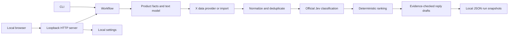

# Architecture

SignalDesk is a single-user, local-first application. The Python runtime has no
third-party dependencies; the browser UI uses plain JavaScript. Run it from a
source checkout with `python3 -m signaldesk serve`. Wheel installation and hosted
multi-user operation are not supported deployment paths yet.

## Module boundaries

| Module | Responsibility |
| --- | --- |
| `core.py` | URL/post validation, normalization, Jev question construction, ranking and CSV escaping; no provider requests |
| `providers.py` | Bounded HTTP requests, fixed data-provider adapters, selected text-model calls, no automatic retries |
| `model_config.py` | Explicit BlockRun/custom-model routing and Base URL/model validation |
| `workflow.py` | Stage orchestration, preflight configuration, evidence checks, progress and atomic run snapshots |
| `settings.py` | Credential validation, session settings and optional atomic owner-only dotenv storage |
| `server.py` | Loopback UI/API, mutation token and Origin/Host checks, one active run per process |
| `web/` | UI and a separate no-API-cost demo player |
| `scripts/live_contract.py` | Explicitly opt-in paid integration check using synthetic fixtures |

The walkthrough is self-contained in `web/`; launch-video source, rendering tools
and production notes are outside this application repository.

## Credentials and provider choice

Custom model mode uses its own API key, HTTPS Base URL and model ID. It never
falls back to a BlockRun key. The model must accept the implemented OpenAI-style
Chat Completions/JSON-object contract. Jev and X data are separate services with
separate credentials. Only BlockRun mode uses the BlockRun model default.

Without the optional BlockRun/Exa website extractor, users supply product facts
as a brief. Search can use official X, TwitterAPI.io, the limited Exa index, or an
import. The browser never receives stored keys. Provider input is untrusted;
reply evidence must match an exact substring of a selected post.

## State and cost semantics

Each run writes `runs/<uuid>.json` atomically. A failed run keeps its partial
results and error state; no result is invented to fill an empty search. These
files are local and ignored by Git. Starting again creates a new run, not a resume.
A process restart loses active in-memory status; saved history remains readable.

Reported costs, Jev estimates and unknown costs remain separate. Request limits
bound workload, not the bill. A timeout can leave payment status unknown; paid
requests are never automatically retried. Settings are locked during an active
run. Replies remain drafts and the app has no outreach endpoint.

## Next architectural steps

1. **Adapter contracts:** split growing provider code behind small typed adapter
   interfaces and contract fixtures before adding more incompatible model APIs.
2. **Installable distribution:** package static assets and separate writable
   application data from the source directory before publishing a wheel/installer.
3. **Durable jobs:** add SQLite and explicit job lifecycle/recovery if resumable
   runs or multiple simultaneous tasks become a requirement. Preserve unknown
   payment state instead of replaying requests automatically.
4. **Hosted service:** requires authentication, per-user credential/data isolation,
   retention controls, destination/network policy and account spending controls.
   Binding this demo to a public interface is not an implementation of those.
5. **Evaluation:** build a consented or synthetic labeled corpus and measure
   precision/recall before claiming that the current thresholds generalize.

These are planned extensions, not features shipped by this demo. Keep the current
source-checkout experience small and reproducible rather than adding infrastructure
that has no current user requirement.
